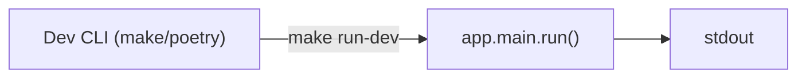

# Arquitectura (Fase 1.1)

```mermaid
flowchart LR
  Dev["Dev CLI (make/poetry)"]
  Main["app.main.run()"]
  Stdout["stdout"]

  Dev -->|"make run-dev"| Main --> Stdout
```

Alcance actual: validar toolchain y entrada al proceso. No hay lógica de dominio ni integraciones externas.

