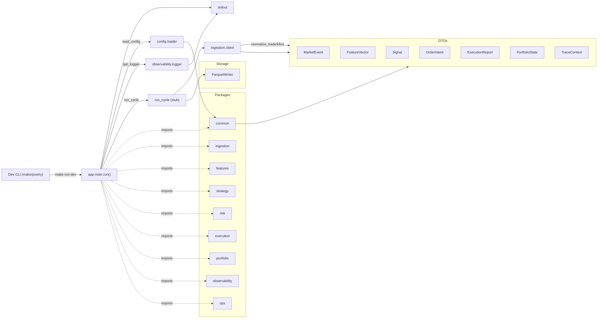
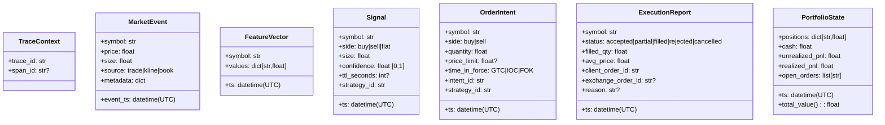
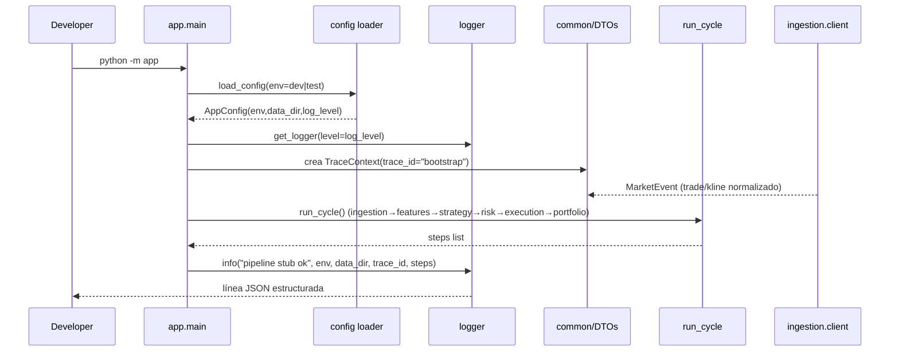

# Arquitectura (Fase 1.1)

## Componentes principales (snapshot fase 1.3)
- `common`: DTOs y utilidades transversales (`normalize_symbol`, `utc_now`, validaciones).
- `ingestion`: (stub) conectores de datos de mercado.
- `features`: (stub) cálculo/serving de features.
- `strategy`: (stub) generación de señales.
- `risk`: (stub) chequeos pre/post trade.
- `execution`: (stub) envío de órdenes/adapter exchanges.
- `portfolio`: (stub) P&L, balances, reconciliación.
- `observability`: (stub) logging/metrics.
- `ops`: (stub) configuración/CLI/runbooks.

## Diagrama de clases (DTOs)

## Diagrama de secuencia (happy-path stub)

Alcance actual: validar toolchain y entrada al proceso. Aún sin lógica de dominio ni integraciones externas.
