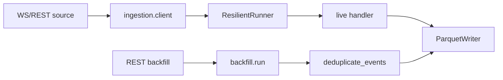
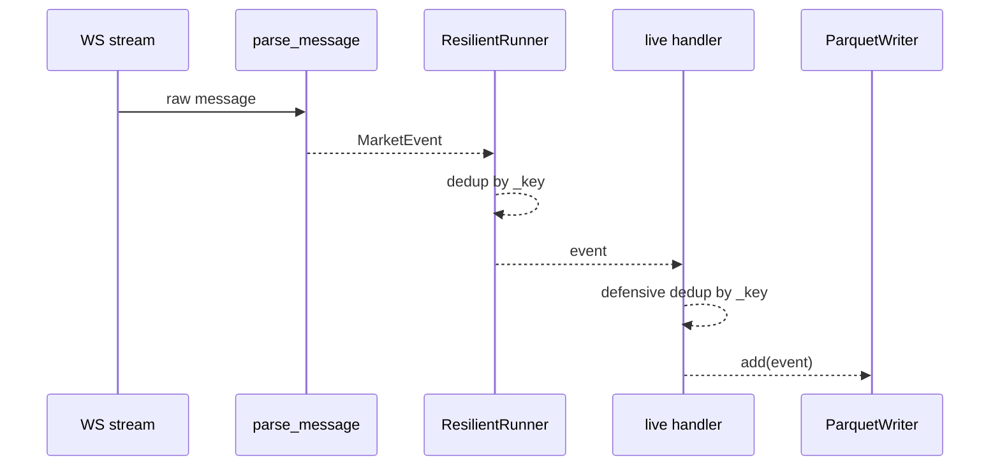
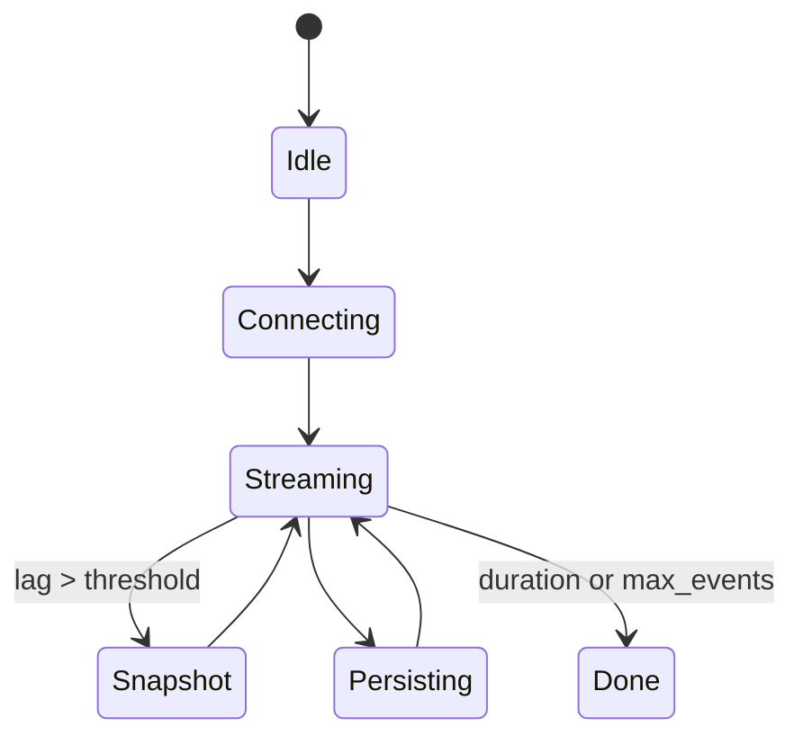
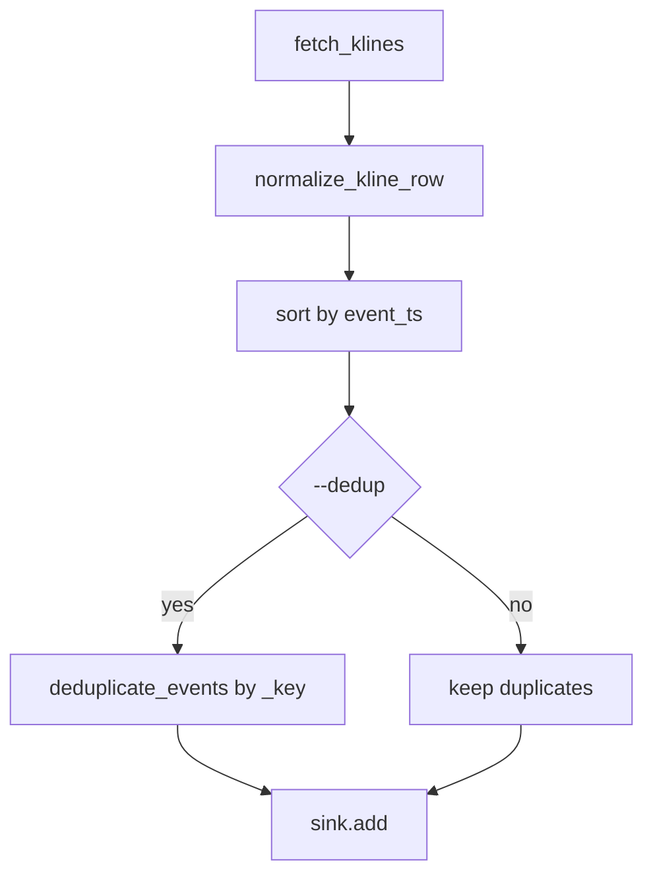

# Modulo de Ingestion - Arquitectura tecnica

## Vision general
El modulo de ingestion convierte eventos de mercado WS/REST en `MarketEvent`, aplica resiliencia basica, deduplicacion opcional y persistencia en Parquet. La deduplicacion se apoya en una clave compartida `app.ingestion.client._key(event)` para que live, backfill y escritura en Parquet utilicen la misma nocion de identidad.

## Modulos principales y responsabilidades
- `ingestion.client`
  - Construye URLs de stream (`build_streams`, `build_ws_url`).
  - Parsea mensajes (`parse_message`) y normaliza payloads (`normalize_trade`, `normalize_kline`).
  - Expone `_key(event)` como identidad canonica del evento.
  - Permite registrar `stream_builder` por tipo para nuevas fuentes o canales sin tocar el core.
- `ingestion.resilience`
  - `ResilientRunner`: loop de consumo con backoff, snapshot opcional, dedup de stream y metricas de lag/latencia/buffer.
- `ingestion.pipeline`
  - `collect_events`: orquesta dry/live, crea el handler live, aplica una segunda barrera de deduplicacion antes de `writer.add` y soporta batching local de IO.
- `ingestion.backfill`
  - Descarga klines historicos, normaliza filas, ordena y opcionalmente deduplica con `--dedup` antes del sink.
- `ingestion.storage`
  - `ParquetWriter`: persiste eventos particionados por simbolo y fecha; puede deduplicar contra datos ya existentes.

## Relaciones entre modulos
- `pipeline.collect_events` usa `client.build_ws_url` y `_ws_stream`, crea `ResilientRunner` y delega la persistencia a `ParquetWriter`.
- `ResilientRunner` usa `client._key` para filtrar duplicados del stream.
- `pipeline._build_live_handler` usa la misma `_key` para evitar que un evento duplicado llegue a `writer.add`.
- `pipeline._LiveBatchHandler` acumula eventos y llama a `writer.add` por lote (`--ingest-batch-size`), manteniendo `max_buffer` en `ResilientRunner`.
- `backfill.run` usa `deduplicate_events` con `_key` antes de escribir.

## Flujo de datos
### Live
`WS -> parse_message -> MarketEvent -> ResilientRunner(dedup/lag) -> handler live(dedup defensiva) -> ParquetWriter -> logs/features opcionales`

### Backfill
`REST klines -> normalize_kline_row -> MarketEvent -> sort(event_ts) -> deduplicate_events(opcional) -> sink/Parquet -> logs`

## Decisiones arquitectonicas
- **Clave compartida `_key`**: evita divergencia entre la deduplicacion de live, backfill y persistencia.
- **Dedup defensiva en dos capas para live**:
  - en `ResilientRunner`, para no reprocesar duplicados;
  - en el handler previo a sink, para no persistirlos aunque entren por una ruta no filtrada.
- **Backfill opt-in**: `--dedup` permite inspeccionar lotes con duplicados o sanearlos explicitamente segun el caso operativo.
- **Parquet dedup opcional**: sigue siendo una barrera final sobre particiones existentes, no el mecanismo principal de deduplicacion.
- **Batching de IO en live**: el handler agrupa eventos antes de escribirlos para reducir llamadas al writer; el flush final fuerza la persistencia del lote incompleto.
- **Modo fast-path (experimental)**: desactiva deduplicacion live, snapshot REST y trazas; usa batching grande y minimiza logs de cierre para priorizar eventos/s.

## Trade-offs
- Doble chequeo de deduplicacion en live aumenta algo el coste CPU, pero reduce el riesgo de filas repetidas.
- El batching local reduce llamadas a `writer.add`, pero aumenta ligeramente la latencia de persistencia hasta completar el lote o cerrar el handler.
- El fast-path mejora throughput sacrificando resync, filtrado de duplicados y trazabilidad operativa detallada.
- La clave `(symbol, event_ts, price, size, source)` es simple y testeable, pero puede ser demasiado estricta o demasiado laxa segun la fuente si en el futuro aparecen ids nativos.
- El backfill sin `--dedup` mantiene visibilidad completa del lote original a costa de permitir duplicados.

## Riesgos actuales
- Si la clave `_key` no representa bien la identidad real del exchange, puede haber falsos positivos o falsos negativos.
- La deduplicacion en memoria no persiste estado entre ejecuciones.
- `ParquetWriter` sigue dependiendo de merge/dedup en memoria cuando la particion ya existe.
- Si el proceso cae antes del cierre del handler, el lote en memoria aun no persistido se pierde.

## Que hace y que no debe hacer
- Hace:
  - normaliza eventos,
  - maneja reconexion basica,
  - deduplica con una clave compartida,
  - escribe Parquet local,
  - expone metricas y logs resumidos.
- No debe:
  - convertirse en una capa de negocio,
  - asumir guarantees exactly-once,
  - depender de caches distribuidas o filtros probabilisticos para esta fase.

## Posibles mejoras
- Sustituir `_key` por ids nativos cuando la fuente los provea.
- Persistir estado minimo de deduplicacion para reinicios.
- Hacer atomicas las escrituras Parquet y anadir retencion/rehidratacion.

## Extension rapida de streams
- Registrar el builder del tipo nuevo con `register_stream_builder("foo", lambda symbol: f"{symbol}@foo")`.
- Registrar el normalizer correspondiente con `register_normalizer("foo", normalize_foo)`.
- Construir la URL con `build_ws_url(ws_base, symbols, stream_types=("trade", "foo"))`.
- Si no se pasa `stream_types`, el comportamiento por defecto sigue siendo Binance-compatible: `trade` + `kline`.

## Diagramas

### Componentes


### Secuencia live


### Estados del sistema


### Flujo backfill


### API
```mermaid
flowchart LR
  CE[collect_events(..., dedup_enabled)] --> LiveEvents
  BF[backfill.run(... --dedup)] --> BackfillRows
  K[_key(event)] --> LiveEvents
  K --> BackfillRows
```
