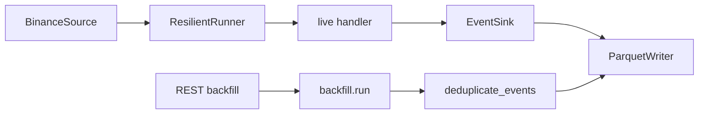
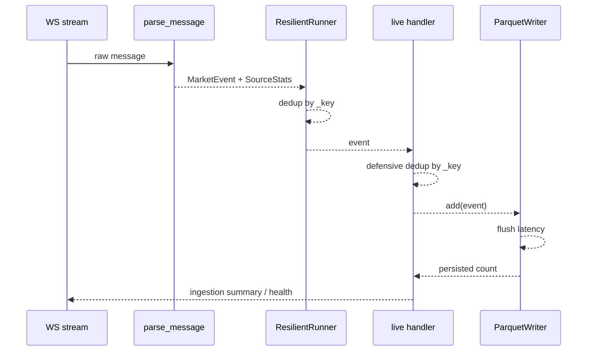
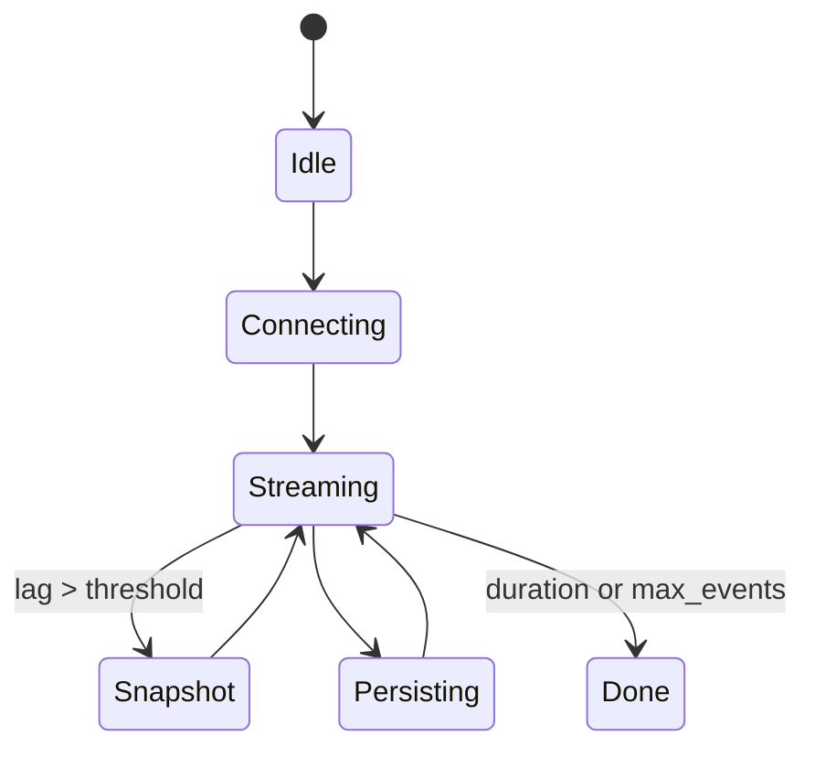
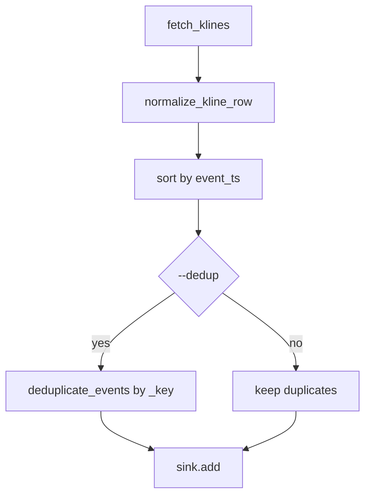

# Modulo de Ingestion - Arquitectura tecnica

## Vision general
El modulo de ingestion convierte eventos de mercado WS/REST en `MarketEvent`, aplica resiliencia basica, deduplicacion opcional y persistencia en Parquet. La deduplicacion se apoya en una clave compartida `app.ingestion.client._key(event)` para que live, backfill y escritura en Parquet utilicen la misma nocion de identidad.

## Modulos principales y responsabilidades
- `ingestion.client`
  - Construye URLs de stream (`build_streams`, `build_ws_url`).
  - Parsea mensajes (`parse_message`) y normaliza payloads (`normalize_trade`, `normalize_kline`).
  - Valida payloads por tipo antes de normalizar (`trade`, `kline`).
  - Expone `_key(event)` como identidad canonica del evento.
  - Permite registrar `stream_builder` por tipo para nuevas fuentes o canales sin tocar el core.
- `ingestion.dedup`
  - Define `Deduplicator` con TTL y limite de capacidad.
  - Expone la identidad compartida por source/type (`identity_from_fields`, `identity_from_event`).
  - Permite registrar una identidad custom por `source`.
- `ingestion.sources`
  - Define el contrato `Source` (`stream`, `snapshot`).
  - Implementa `BinanceSource` como adaptador por defecto para WS/REST.
  - Implementa `StaticSource` para tests y ejecucion controlada sin red.
  - Expone `SourceStats` con `source_events_in`, `events_valid`, `events_invalid`, `snapshot_runs`, `snapshot_rows`, `rejected_payloads` y `error_sink_failures`.
- `ingestion.resilience`
  - `ResilientRunner`: loop de consumo con backoff, snapshot opcional, dedup de stream y metricas de entrada/salida/duplicados/lag/latencia/buffer.
  - Gestiona una cola bounded y una politica explicita de saturacion: `pause`, `drop_oldest`, `drop_newest`, `fail`.
- `ingestion.checkpoints`
  - `CheckpointStore`: persiste `last_event_ts`, una ventana corta de claves dedup y metadata minima de ejecucion.
  - Se usa para reanudar live desde el ultimo estado local conocido sin pretender exactly-once.
- `ingestion.pipeline`
  - `collect_events`: orquesta dry/live, ejecuta un `Source`, consume un `EventSink`, aplica una segunda barrera de deduplicacion antes de persistir, soporta batching local de IO, carga/guarda checkpoints live y emite un resumen agregado final de la ejecucion.
- `ingestion.backfill`
  - Descarga klines historicos, normaliza filas, ordena y opcionalmente deduplica con `--dedup` antes del sink.
- `ingestion.storage`
  - `ParquetWriter`: persiste eventos particionados por simbolo y fecha; puede deduplicar contra datos ya existentes, escribe con `tmp + rename`, separa eventos aceptados de eventos confirmados en disco y mide `last_write_latency_seconds` / `max_write_latency_seconds`.
- `ingestion.sinks`
  - Define `EventSink` y `ParquetEventSink`.
  - Define `ErrorSink`, `NullErrorSink` y `JsonlErrorSink` para trazado local de payloads rechazados.
  - Permite desacoplar live del writer concreto en pruebas y futuros destinos.
  - `ParquetEventSink` expone `accepted_count`, `persisted_count`, `buffered_count`, `write_latency_seconds` y `last_write_latency_seconds`.

## Relaciones entre modulos
- `pipeline.collect_events` usa un `Source`, crea `ResilientRunner` y delega la persistencia a un `EventSink`.
- Si el path live es el real (sin `source`/`sink` custom), `collect_events` carga `ingestion-checkpoint.json` al arrancar y lo reescribe tras un cierre limpio del sink.
- `BinanceSource` valida payloads raw antes de normalizar; si un mensaje es incompatible, lo envia al `ErrorSink` y sigue procesando el stream.
- `ResilientRunner` usa `client._key` para filtrar duplicados del stream.
- `ResilientRunner`, el handler live, `backfill.run` y `ParquetWriter` usan ahora la misma semantica de identidad via `ingestion.dedup`.
- `ResilientRunner` exporta el estado minimo necesario para checkpoint (`last_event_ts` + claves dedup recientes).
- `pipeline._build_live_handler` usa la misma `_key` para evitar que un evento duplicado llegue a `writer.add`.
- `pipeline._LiveBatchHandler` acumula eventos y llama a `sink.add` por lote (`--ingest-batch-size`), manteniendo `max_buffer` en `ResilientRunner`.
- `backfill.run` usa `deduplicate_events` con `_key` antes de escribir.
- `runner.run` reutiliza `BinanceSource`/`StaticSource` y `ParquetEventSink`, evitando duplicar la logica WS/REST del pipeline.

## Flujo de datos
### Live
`Source.stream -> MarketEvent -> ResilientRunner(dedup/lag) -> handler live(dedup defensiva) -> EventSink -> logs/features opcionales`

### Backfill
`REST klines -> normalize_kline_row -> MarketEvent -> sort(event_ts) -> deduplicate_events(opcional) -> sink/Parquet -> logs`

## Decisiones arquitectonicas
- **Clave compartida `_key`**: evita divergencia entre la deduplicacion de live, backfill y persistencia.
- **Deduplicator dedicado**: encapsula TTL, capacidad y export/import de estado para checkpoint sin dejar sets dispersos por el wiring.
- **Contrato minimo `Source/Sink`**: desacopla la orquestacion de ingestion de Binance y de Parquet sin introducir una jerarquia compleja.
- **Dedup defensiva en dos capas para live**:
  - en `ResilientRunner`, para no reprocesar duplicados;
  - en el handler previo a sink, para no persistirlos aunque entren por una ruta no filtrada.
- **Backfill opt-in**: `--dedup` permite inspeccionar lotes con duplicados o sanearlos explicitamente segun el caso operativo.
- **Parquet dedup opcional**: sigue siendo una barrera final sobre particiones existentes, no el mecanismo principal de deduplicacion.
- **Persistencia atomica por particion**: cada `data.parquet` se reconstruye en un temporal y solo se publica con `replace` cuando la escritura completa termina bien.
- **Batching de IO en live**: el handler agrupa eventos antes de escribirlos para reducir llamadas al writer; el flush final fuerza la persistencia del lote incompleto.
- **Backpressure explicito**: el runner ya no usa un pseudo-buffer binario; usa una cola bounded y aplica una politica visible cuando la cola se llena.
- **Modo fast-path (experimental)**: desactiva deduplicacion live, snapshot REST y trazas; usa batching grande y minimiza logs de cierre para priorizar eventos/s.
- **Alertas experimentales de operacion**: `--ingest-lag-warn` y `--ingest-buffer-warn` emiten `WARNING` una vez por ciclo live si se supera el umbral configurado.
- **Observabilidad operativa seria**: en modo normal se emiten `ingestion summary` e `ingestion health`. El summary separa `source_events_in`, `events_valid`, `events_invalid`, `events_dedup_skipped`, `events_buffer_dropped`, `events_persisted`, `snapshot_runs`, `snapshot_rows`, `processing_latency_seconds`, `write_latency_seconds` y `reconnects`; `ingestion health` resume el estado final con el mismo `trace_id`. En live se conserva `ingestion live complete` por compatibilidad.
- **Metricas por politica de saturacion**: `buffer_overflows`, `buffer_pauses`, `buffer_drop_oldest`, `buffer_drop_newest`, `buffer_failures` y `backpressure_policy` quedan en logs de cierre y warnings de presion.
- **Fail-fast por defecto en live**: si la ingesta real falla, `collect_events` propaga el error. El fallback a `dry` solo existe cuando se activa explicitamente `--allow-live-fallback`.
- **Politica explicita de error en live**:
  - `fail_fast`: propaga el error
  - `allow_fallback`: solo errores de `source` degradan a `dry`
  - `degraded`: solo errores de `source` devuelven `[]` y quedan logueados como degradacion
  - Errores `sink`, `parse` y `validation` no se enmascaran como `source`.
- **DLQ local simple**: los rechazos de payload se escriben en JSONL en `data_dir/errors/ingestion-dlq.jsonl` por defecto. Si el `ErrorSink` falla, el stream sigue vivo y se incrementa `error_sink_failures`.
- **Checkpoint local minimo**: live persiste `data_dir/<env>/state/ingestion-checkpoint.json` con el ultimo timestamp procesado, metadata minima y una ventana corta de claves dedup para contener duplicados inmediatos tras reinicio.
- **Memoria acotada**: el deduplicador expira por TTL y expulsa por capacidad para evitar crecimiento sin control en runs largos.
- **Separacion accepted/persisted**: el writer mantiene contadores de eventos aceptados, persistidos y pendientes, para distinguir buffer en memoria de datos ya confirmados en disco.

## Trade-offs
- Doble chequeo de deduplicacion en live aumenta algo el coste CPU, pero reduce el riesgo de filas repetidas.
- El batching local reduce llamadas a `writer.add`, pero aumenta ligeramente la latencia de persistencia hasta completar el lote o cerrar el handler.
- El fast-path mejora throughput sacrificando resync, filtrado de duplicados y trazabilidad operativa detallada.
- Umbrales demasiado bajos pueden generar ruido; por defecto quedan desactivados (`None`).
- La clave `(symbol, event_ts, price, size, source)` es simple y testeable, pero puede ser demasiado estricta o demasiado laxa segun la fuente si en el futuro aparecen ids nativos.
- TTL y capacidad implican que duplicados muy tardios o muy alejados fuera de la ventana retenida pueden reaparecer; es una concesion deliberada para no crecer sin limite.
- El backfill sin `--dedup` mantiene visibilidad completa del lote original a costa de permitir duplicados.

## Riesgos actuales
- Si la clave `_key` no representa bien la identidad real del exchange, puede haber falsos positivos o falsos negativos.
- La deduplicacion en memoria no persiste estado entre ejecuciones.
- El checkpoint solo contiene una ventana corta de claves dedup; limita duplicados inmediatos tras reinicio, no garantiza replay perfecto ni exactly-once.
- `ParquetWriter` sigue dependiendo de merge/dedup en memoria cuando la particion ya existe; la atomicidad protege el archivo final, no el coste de memoria del merge.
- Si el proceso cae antes del cierre del handler, el lote en memoria aun no persistido se pierde.

## Que hace y que no debe hacer
- Hace:
  - normaliza eventos,
  - valida payloads antes y despues de normalizar,
  - maneja reconexion basica,
  - clasifica errores de source/parse/validation/sink,
  - deduplica con una clave compartida,
  - escribe Parquet local,
  - expone metricas y logs resumidos, incluido un resumen agregado de cierre por ejecucion.
- No debe:
  - convertirse en una capa de negocio,
  - asumir guarantees exactly-once,
  - degradar silenciosamente a datos sinteticos cuando live falla,
  - depender de caches distribuidas o filtros probabilisticos para esta fase.

## Posibles mejoras
- Sustituir `_key` por ids nativos cuando la fuente los provea.
- Persistir estado minimo de deduplicacion para reinicios.
- Anadir retencion/rehidratacion y compactacion offline cuando el volumen crezca.

## Extension rapida de streams
- Registrar el builder del tipo nuevo con `register_stream_builder("foo", lambda symbol: f"{symbol}@foo")`.
- Registrar el normalizer correspondiente con `register_normalizer("foo", normalize_foo)`.
- Construir la URL con `build_ws_url(ws_base, symbols, stream_types=("trade", "foo"))`.
- Si no se pasa `stream_types`, el comportamiento por defecto sigue siendo Binance-compatible: `trade` + `kline`.

## Operacion a altas tasas
- `--ingest-batch-size`: baja llamadas a `writer.add`; usar `32-128` para un punto medio razonable.
- `--no-ingest-dedup`: elimina dos barreras de deduplicacion en live; solo aceptable si el consumidor tolera repetidos.
- `--fast-path`: aplica la configuracion agresiva completa y debe tratarse como experimental.
- `--ingest-lag-warn` y `--ingest-buffer-warn`: no corrigen el problema; solo hacen visible presion operativa.
- `--ingest-backpressure-policy`: define como degrada el runner bajo saturacion; `pause` es el default seguro.
- Recomendacion practica:
  - empezar con dedup on y batch medio;
  - activar warnings;
  - pasar a `fast-path` solo si el cuello real es CPU/IO del proceso y puedes tolerar duplicados o lag sin resync.

## Diagramas

### Componentes


### Secuencia live


### Estados del sistema


### Flujo backfill


### API
```mermaid
flowchart LR
  CE[collect_events(..., dedup_enabled)] --> LiveEvents
  BF[backfill.run(... --dedup)] --> BackfillRows
  K[_key(event)] --> LiveEvents
  K --> BackfillRows
```
