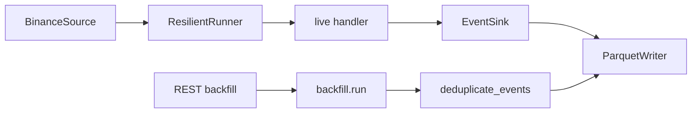
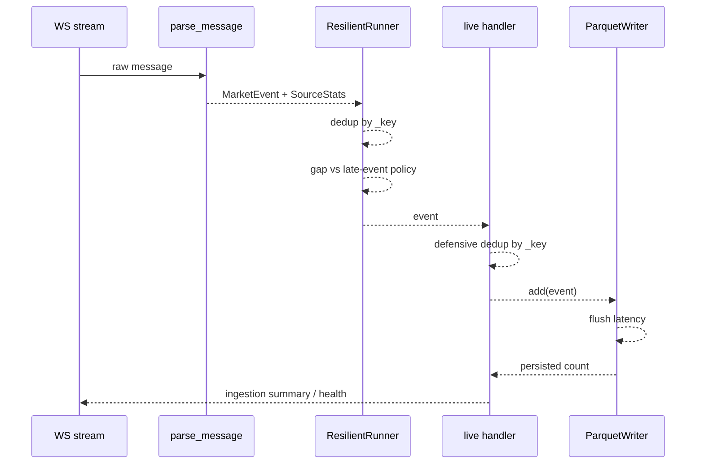
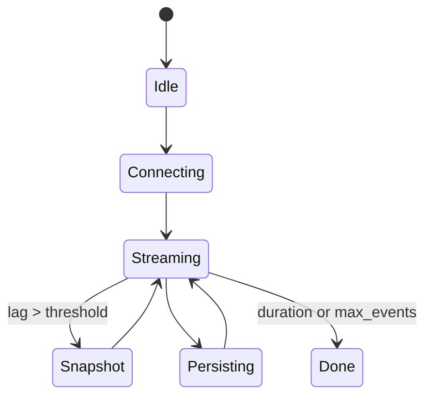
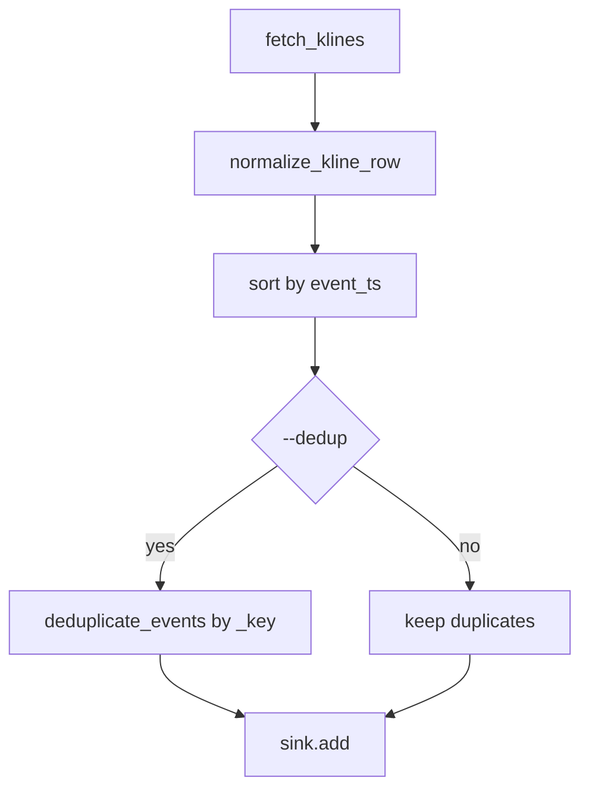

# Modulo de Ingestion - Arquitectura tecnica

## Vision general
El modulo de ingestion convierte eventos de mercado WS/REST en `IngestionEvent` tipado y soporta publicamente `TradeEvent` y `BarEvent`. `BookEvent` permanece como placeholder experimental para trabajo futuro de depth/quotes y hoy esta fuera de scope para runtime live y storage normalized. La deduplicacion se apoya en una clave compartida `app.ingestion.client._key(event)` para que live, backfill y escritura en Parquet utilicen la misma nocion de identidad.

## Modulos principales y responsabilidades
- `ingestion.client`
  - Construye URLs de stream (`build_streams`, `build_ws_url`).
  - Parsea mensajes (`parse_message`) y normaliza payloads (`normalize_trade`, `normalize_kline`).
  - Valida payloads por tipo antes de normalizar (`trade`, `kline`).
  - Expone `_key(event)` como identidad canonica del evento.
  - Permite registrar `stream_builder` por tipo para nuevas fuentes o canales sin tocar el core.
  - Los handlers Binance por feed ya no viven inline en este modulo; delega en:
    - `marketdata.connectors.binance.BinanceTradeNormalizer`
    - `marketdata.connectors.binance.BinanceBarNormalizer`
- `marketdata.models`
  - Define el contrato canonico tipado:
    - `TradeEvent`
    - `BarEvent`
    - `BookEvent` solo como placeholder experimental; no forma parte del scope soportado de ingestion/storage
  - Expone adapters temporales de migracion:
    - `legacy_market_event_to_trade`
    - `legacy_market_event_to_bar`
    - `typed_event_to_legacy`
    - `ensure_legacy_market_event`
  - Mantiene compatibilidad transitoria con `app.common.dto.MarketEvent` en bordes explicitos de compatibilidad, pero `collect_events(...)` y el handler live ya no degradan el flujo principal a legacy.
- `marketdata.instruments`
  - Define `Instrument` e `InstrumentCatalog`.
  - Resuelve metadata minima por `(venue, symbol)`:
    - `base_asset`
    - `quote_asset`
    - `contract_type`
    - `tick_size`
    - `step_size`
    - `price_precision`
    - `size_precision`
  - Los normalizadores consultan este catalogo; un simbolo no soportado falla rapido durante la normalizacion.
- `marketdata.validators`
  - Centraliza validacion explicita por tipo:
    - `validate_trade_payload`, `validate_kline_payload`
    - `validate_trade_event`, `validate_bar_event`, `validate_book_event`
    - `validate_ingestion_event`
  - Rechaza `NaN`, `inf`, signos invalidos, OHLC inconsistente, libros cruzados y timestamps demasiado adelantados respecto al reloj del proceso.
  - En `BinanceSource`, los rechazos de payload raw se mandan al DLQ. En fuentes custom que inyectan eventos ya tipados, un evento invalido falla rapido y no se convierte en payload de DLQ.
  - Semantica temporal oficial:
    - `exchange_ts`: timestamp original del mercado/fuente normalizada
    - `receive_ts`: instante de recepcion en el borde del conector
    - `process_ts`: instante en el que el evento queda normalizado o es aceptado por el runner
    - Regla de migracion legacy: `MarketEvent.event_ts` se interpreta como `exchange_ts`
- `marketdata.raw_sink`
  - Define `RawRecord`, `RawSink`, `NullRawSink` y `JsonlRawSink`.
  - `JsonlRawSink` escribe append-only en:
    - `<data_dir>/raw/env=<env>/venue=<venue>/stream_type=<stream_type>/symbol=<symbol>/date=<yyyy-mm-dd>/events.jsonl`
  - Cada linea JSONL persiste:
    - `payload`
    - `venue`
    - `stream_type`
    - `symbol`
    - `exchange_ts`
    - `receive_ts`
    - `run_id`
    - `ingestion_seq`
    - `trace_id`
    - `source_id`
- `ingestion.storage`
  - `ParquetWriter` mantiene compatibilidad v1/v2, pero para `normalized/trades` y `normalized/bars` ya delega en writers tipados.
  - `TradeParquetWriter` persiste columnas first-class para trades:
    - `trade_id`
    - `side`
    - `exchange_ts`
    - `receive_ts`
    - `process_ts`
    - `source_id`
  - `BarParquetWriter` persiste columnas first-class para bars:
    - `open`
    - `high`
    - `low`
    - `close`
    - `volume`
    - `interval`
    - `open_ts`
    - `close_ts`
    - `exchange_ts`
    - `receive_ts`
    - `process_ts`
    - `source_id`
  - Se conserva `metadata` por compatibilidad, pero ya no es el almacen principal de identidad o OHLCV.
- `marketdata.replay`
  - Define `ReplaySource` compatible con el contrato `Source`.
  - Lee raw landing en orden determinista usando:
    - `run_id + ingestion_seq` cuando ambos existen
    - fallback legacy: `receive_ts`, path de particion y numero de linea
  - `detect_replay_order_ambiguities(...)` detecta raws con metadata parcial de orden (por ejemplo `ingestion_seq` sin `run_id`) para evitar interpretarlos como replay fuerte.
  - Re-normaliza payloads usando la version de normalizador solicitada (`normalizer_version`).
  - La politica actual es global: toda normalizacion nueva usa `normalizer_version="v1"` hasta que se introduzca una migracion versionada.
  - Soporta filtros por:
    - `symbol`
    - `stream_types`
    - `venue`
    - `start_ts`
    - `end_ts`
  - Soporta velocidades:
    - `full-speed`
    - `step-by-step`
- `ingestion.dedup`
  - Define `Deduplicator` con TTL y limite de capacidad.
  - Define la interfaz `IdentityProvider`.
  - Expone la identidad compartida por source/type (`identity_from_fields`, `identity_from_event`).
  - Jerarquia actual de identidad:
    - `trade_id`
    - `sequence_id`
    - `source_id`
    - fallback heuristico `(symbol, event_ts, price, size, source)`
  - Permite registrar un `IdentityProvider` o un builder custom por `source`.
- `marketdata.temporal_state`
  - Define `TemporalPartitionKey` con la clave `(venue, symbol, stream_type)`.
  - Define `TemporalStateStore` y `TemporalStreamState` para mantener watermarks y metricas temporales por stream.
  - Evita comparar simbolos distintos contra un unico `last_event_ts` global cuando el feed llega intercalado.
- `marketdata.gaps`
  - Define `GapObservation` y `detect_gap(...)`.
  - Orden de evaluacion:
    - secuencia rota (`trade_id` / `sequence_id`) -> `sequence_gap_detection`
    - si no hay secuencia usable, hueco temporal sobre umbral -> `weak_gap_detection`
  - `weak_gap_detection` es deliberadamente heuristico; no se debe interpretar como garantia fuerte de perdida.
- `marketdata.recovery`
  - Define `RecoveryPolicy`, `TradeRecoveryPolicy`, `BarRecoveryPolicy` y `recovery_policy_for_event(...)`.
  - El recovery ya no es generico:
    - `trade`: no acepta snapshots de barras como catch-up. Un gap fuerte sin recovery exacto se marca `gap_irreparable`.
    - `kline`: usa snapshots filtrados por `(venue, symbol, stream_type)` y elimina el borde duplicado via dedup del runner, pero mientras el resync siga apoyandose en una ventana REST acotada no se declara recovery exacto.
  - `supports_live_recovery(...)` hace explicito que el alcance live actual es bars-only (`kline`).
- `marketdata.support_matrix`
  - Define `FeedSupport` y `FEED_SUPPORT_MATRIX`.
  - La matriz actual declara por `feed_type`:
    - `supports_live`
    - `supports_exact_recovery`
    - `supports_handoff`
  - Gating actual:
    - cualquier `mode=live` rechaza feeds sin `supports_live`
    - `production_mode` rechaza ademas feeds sin recovery exacto o sin handoff soportado
    - `kline` conserva `supports_live=True` y `supports_handoff=True`, pero `supports_exact_recovery=False` hasta que exista recovery real basado en ventana/cursor
- `marketdata.handoff`
  - Define `HistoricalWindow`, `windowed_bootstrap_events(...)` y `HandoffSource`.
  - `HandoffSource` compone:
    - bootstrap historico filtrado por ventana
    - stream live real
  - Integra checkpoint local si existe:
    - omite bootstrap ya cubierto por `last_event_ts` o cursor conocido
    - deduplica el solape bootstrap/live con la misma identidad fuerte de ingestion
  - Si no puede garantizar continuidad en el borde, incrementa `handoff_inconsistent` y falla rapido en modo estricto.
  - La validacion de borde ya no mira solo el ultimo watermark/cursor: compara la cola historica emitida y la cabecera live por identidad fuerte y timestamps para detectar solapes inconsistentes o regresiones temporales.
- `ingestion.sources`
  - Define el contrato `Source` (`stream`, `snapshot`).
  - Implementa `BinanceSource` como adaptador por defecto para WS/REST.
  - Expone wrappers por feed:
    - `marketdata.connectors.binance_sources.BinanceTradeSource`
    - `marketdata.connectors.binance_sources.BinanceBarSource`
  - Implementa `StaticSource` para tests y ejecucion controlada sin red.
  - Expone `SourceStats` con `source_events_in`, `events_valid`, `events_invalid`, `snapshot_runs`, `snapshot_rows`, `rejected_payloads`, `error_sink_failures`, `handoff_bootstrap_rows`, `handoff_overlap_dropped` y `handoff_inconsistent`.
  - Define `HeartbeatPolicy` y `heartbeat_policy_for_streams(...)`.
  - El watchdog de websocket usa tres umbrales:
    - `recv_timeout_seconds`: timeout corto de polling
    - `ping_interval_seconds`: a partir de aqui intenta `ping/pong`
    - `inactivity_timeout_seconds`: si no hay frames ni `pong`, se considera feed no saludable y fuerza reconnect
  - El snapshot REST usa retry por endpoint con backoff exponencial + jitter inyectable.
  - Un `CircuitBreaker` simple (`closed`, `open`, `half-open`) protege el path de snapshot/recovery frente a tormentas de retries cuando el endpoint sigue degradado.
  - `BinanceSource` ya no mezcla normalizacion trade/kline en el mismo bloque; delega en el registry de `marketdata.connectors.binance`.
  - `SourceStats.stream_metrics` agrega contadores por `(venue, symbol, stream_type)` y mide latencia raw por stream.
- `ingestion.resilience`
  - `ResilientRunner`: loop de consumo con backoff, snapshot opcional, dedup de stream y metricas de entrada/salida/duplicados/gap temporal/eventos tardios/latencia/buffer.
  - Gestiona una cola bounded y una politica explicita de saturacion: `pause`, `drop_oldest`, `drop_newest`, `fail`.
  - Gestiona una politica temporal explicita: `accept`, `drop`, `fail`.
  - Resuelve el recovery por tipo de feed antes de disparar resync:
    - barras -> snapshot del mismo stream
    - trades -> sin recovery generico desde barras
  - El reconnect usa backoff exponencial con `jitter_fn` inyectable para mantener tests deterministas.
  - Mantiene watermarks por `(venue, symbol, stream_type)` via `TemporalStateStore`; las metricas agregadas siguen saliendo en el summary, pero se calculan sin mezclar streams distintos.
  - `temporal_streams` ya no solo guarda watermarks; tambien mantiene contadores por stream (`messages_in_total`, `duplicates_total`, `buffer_dropped_total`) y etiquetas obligatorias (`venue`, `symbol`, `stream_type`).
  - Mantiene estado de gap por stream:
    - `gap_detected`
    - `gap_irreparable`
    - `gaps_total`
    - `gap_irreparable_total`
    - `last_gap_detection_mode`
- `ingestion.checkpoints`
  - `CheckpointStore`: persiste `last_event_ts`, metadata minima y estado por stream.
  - Cada stream `(venue, symbol, stream_type)` guarda:
    - watermark `last_event_ts`
    - cursor conocido (`trade_id`, `sequence_id` o `source_id` si existe)
    - una ventana corta de claves dedup del mismo stream
  - Se usa para reanudar live desde el ultimo estado local conocido sin pretender exactly-once.
- `ingestion.pipeline`
  - `collect_events`: orquesta dry/live, ejecuta un `Source`, consume un `EventSink`, aplica una segunda barrera de deduplicacion antes de persistir, soporta batching local de IO, carga/guarda checkpoints live y emite un resumen agregado final de la ejecucion.
- `ingestion.service`
  - `run_ingestion_service(...)`: entrypoint aislado para ingestion. Ejecuta `collect_events(...)` sin invocar feature engineering, strategy, risk ni execution.
- `ingestion.backfill`
  - Descarga klines historicos, normaliza filas a `BarEvent`, escribe raw append-only reutilizando `JsonlRawSink`, ordena y opcionalmente deduplica con `--dedup` antes del sink normalized.
  - El alcance historico soportado queda formalmente limitado a bars (`kline`). Trade historical backfill no esta implementado ni debe asumirse.
- `ingestion.storage`
  - `ParquetWriter`: persiste eventos normalized v2 separados por tipo (`trades`, `bars`) y particionados por `env`, `venue`, `symbol`, `date`; puede deduplicar contra datos ya existentes, escribe con `tmp + rename`, separa eventos aceptados de eventos confirmados en disco y mide `last_write_latency_seconds` / `max_write_latency_seconds`.
  - `book` queda fuera de scope en storage normalized hasta que exista un feed real y un schema typed first-class; el writer falla explicitamente si recibe ese tipo.
  - Cada dataset normalized `v2` persiste `normalizer_version` como columna de datos y como metadata de Parquet.
  - Helpers de layout:
    - `normalized_partition_path(...)`
    - `legacy_partition_path(...)`
    - `list_normalized_parquet_files(...)`
  - `validate_output_path(...)`: valida que la ruta de escritura sea directorio valido y escribible; en modo estricto puede exigir ruta absoluta.
- `ingestion.sinks`
  - Define `EventSink` y `ParquetEventSink`.
  - Define `ErrorSink`, `NullErrorSink` y `JsonlErrorSink` para trazado local de payloads rechazados.
  - Permite desacoplar live del writer concreto en pruebas y futuros destinos.
  - `ParquetEventSink` expone `accepted_count`, `persisted_count`, `buffered_count`, `write_latency_seconds` y `last_write_latency_seconds`.

## Relaciones entre modulos
- `pipeline.collect_events` usa un `Source`, crea `ResilientRunner` y delega la persistencia a un `EventSink`.
- En el wiring live por defecto, `collect_events` crea `BinanceSource(..., raw_sink=JsonlRawSink(...))`, de modo que el raw valido queda persistido antes de que el sink normalized pueda fallar.
- Cuando el runner detecta un gap, aplica una `RecoveryPolicy` por feed:
  - si el feed es `kline`, intenta resync con snapshot compatible del mismo stream;
  - si el feed es `trade`, no rellena el hueco con barras y deja el gap fuerte como `gap_irreparable`.
- Si el source usado es `HandoffSource`, `collect_events` le inyecta el checkpoint local cargado antes de arrancar live para que el bootstrap historico no reprocesse borde ya cubierto.
- `Source` y `EventSink` aceptan eventos tipados o `MarketEvent` legacy como interfaz de compatibilidad; el surface soportado publicamente hoy es `TradeEvent` + `BarEvent`. `BookEvent` no entra en el runtime soportado y el handler live ya no convierte a `MarketEvent` en el hot path.
- Si el path live es el real (sin `source`/`sink` custom), `collect_events` carga `ingestion-checkpoint.json` al arrancar y lo reescribe tras un cierre limpio del sink.
- `BinanceSource` valida payloads raw antes de normalizar y valida el evento resultante tras normalizar; si un mensaje es incompatible, lo envia al `ErrorSink` y sigue procesando el stream.

## Taxonomia de logs y metricas per-stream
- Etiquetas obligatorias para cualquier breakdown:
  - `venue`
  - `symbol`
  - `stream_type`
- Contadores por stream expuestos en `ingestion summary.stream_metrics`:
    - `messages_in_total`
    - `messages_invalid_total`
    - `invalid_timestamp_total`
    - `duplicates_total`
    - `gaps_total`
    - `gap_irreparable_total`
    - `reconnects_total`
    - `heartbeat_missed_total`
    - `buffer_dropped_total`
    - `raw_write_latency`
    - `normalized_write_latency`
    - `exchange_receive_skew_seconds`
    - `receive_process_skew_seconds`
- Logs estructurados operativos:
  - `gap detected`
  - `gap irreparable`
  - `recovery started`
  - `recovery completed`
  - `recovery failed`
  - `handoff bootstrap started`
  - `handoff bootstrap completed`
  - `handoff overlap dropped`
  - `handoff inconsistent`
- Alertas operativas canonicas (`message = operational alert`):
    - `reconnect_storm` -> `warning`, umbral 3 reconnects del mismo stream
    - `gap_detected` -> `warning`, umbral 1
    - `gap_irreparable` -> `error`, umbral 1
    - `heartbeat_missed` -> `warning`, umbral 1 watchdog timeout
    - `snapshot_retry_exhausted` -> `error`, umbral 1 agotamiento de retries REST o breaker abierto
    - `invalid_timestamp_detected` -> `warning`, umbral 1 timestamp invalido o skew fuera de contrato
    - `shadow_semantic_diff` -> `error`, umbral 1 divergencia semantica entre primary/shadow
    - `dlq_spike` -> `warning`, umbral 3 payloads invalidos del mismo stream
    - `sink_failure` -> `error`, umbral 1 fallo de `raw_sink`, `error_sink` o `normalized` sink
- Campos estandar de alerta:
  - `alert_type`
  - `alert_severity`
  - `observed`
  - `threshold`
  - `recommended_action`
- `ingestion health` resume ademas:
  - `streams_observed`
  - `streams_degraded`
  - `invalid_timestamp_total`
  - `exchange_receive_skew_seconds`
  - `receive_process_skew_seconds`
  - `shadow_row_diff_total`
  - `shadow_checksum_diff_total`
- Shadow mode / promotion safety:
  - el comparador shadow ya evalua paridad semantica de dataset entre `v1` y `v2`
  - compara:
    - `row_count`
    - `identity set`
    - `checksum` por particion
    - `min/max event_ts`
    - `gaps_total`
  - diferencias de latencia se persisten, pero no bloquean por si solas
- Mapping temporal actual para Binance:
  - trade WS -> `exchange_ts = E`
  - kline WS/REST -> `exchange_ts = k.T` si existe, si no `E`
  - `receive_ts` se fija al recibir el frame WS o la respuesta REST
  - `process_ts` se fija al normalizar; si una fuente custom no lo aporta, `ResilientRunner` lo completa al aceptar el evento
- El raw valido se escribe inmediatamente despues de validar y normalizar el mensaje, antes de hacer `yield` al pipeline. Si el sink normalized falla despues, el raw ya queda preservado para diagnostico/replay.
- `ReplaySource` se apoya en raw landing; no lee normalized Parquet. Esto permite re-ejecutar normalizacion de forma determinista para backtesting/debugging sin depender del layout final del sink.
- `normalizer_version` queda fijada explicitamente tanto en replay como en normalized. Si mañana cambia la normalizacion, el contrato exige introducir una nueva version y no sobreescribir silenciosamente el significado de los datasets ya escritos.
- La suite cuantitativa dedicada queda separada por area:
  - `tests/marketdata/replay/test_replay_guarantees.py`: orden exacto raw -> replay y paridad raw/normalized
  - `tests/ingestion/test_raw_normalized_parity.py`: paridad live raw -> replay -> normalized para trades
  - `tests/marketdata/temporal/test_temporal_guarantees.py`: multi-simbolo intercalado y secuencia rota
  - `tests/marketdata/dedup/test_dedup_guarantees.py`: identidad nativa frente a colisiones heuristicas
  - `tests/marketdata/handoff/test_handoff_guarantees.py`: bootstrap historico -> live, dedup de borde y handoff inconsistente
  - `tests/marketdata/recovery/test_recovery_guarantees.py`: recovery exacto de barras y `gap_irreparable` en trades sin recovery exacto
- `ResilientRunner` usa `client._key` para filtrar duplicados del stream.
- `ResilientRunner`, el handler live, `backfill.run` y `ParquetWriter` usan ahora la misma semantica de identidad via `ingestion.dedup`.
- `ResilientRunner` exporta el estado minimo necesario para checkpoint (`last_event_ts` + claves dedup recientes).
- El watermark temporal runtime ya no es global: cada stream `(venue, symbol, stream_type)` mantiene su propio `last_event_ts`.
- El checkpoint ya persiste cursor/watermark/dedup window por stream; ademas conserva el maximo global `last_event_ts` por compatibilidad con readers legacy.
- `pipeline._build_live_handler` usa la misma `_key` para evitar que un evento duplicado llegue a `writer.add`.
- `pipeline._LiveBatchHandler` acumula eventos y llama a `sink.add` por lote (`--ingest-batch-size`), manteniendo `max_buffer` en `ResilientRunner`.
- `backfill.run` usa `deduplicate_events` con `_key` antes de escribir.
- `runner.run` reutiliza `BinanceSource`/`StaticSource` y `ParquetEventSink`, evitando duplicar la logica WS/REST del pipeline.

## Flujo de datos
### Live
`Source.stream -> MarketEvent -> ResilientRunner(dedup/lag) -> handler live(dedup defensiva) -> EventSink -> logs/features opcionales`

### Backfill
`REST klines -> RawRecord(JSONL append-only) + normalize_kline_row -> BarEvent -> sort(event_ts) -> deduplicate_events(opcional) -> sink/Parquet -> logs`

- Scope explicito:
  - soportado: `kline`
  - no soportado: `trade`

## Decisiones arquitectonicas
- **Clave compartida `_key`**: evita divergencia entre la deduplicacion de live, backfill y persistencia.
- **Deduplicator dedicado**: encapsula TTL, capacidad y export/import de estado para checkpoint sin dejar sets dispersos por el wiring.
- **Contrato minimo `Source/Sink`**: desacopla la orquestacion de ingestion de Binance y de Parquet sin introducir una jerarquia compleja.
- **Dedup defensiva en dos capas para live**:
  - en `ResilientRunner`, para no reprocesar duplicados;
  - en el handler previo a sink, para no persistirlos aunque entren por una ruta no filtrada.
- **Backfill opt-in**: `--dedup` permite inspeccionar lotes con duplicados o sanearlos explicitamente segun el caso operativo.
- **Parquet dedup opcional**: sigue siendo una barrera final sobre particiones existentes, no el mecanismo principal de deduplicacion.
- **Persistencia normalized v2 por tipo**: trades y bars ya no comparten particion. El layout actual es:
  - `<data_dir>/normalized/trades/env=<env>/venue=<venue>/symbol=<symbol>/date=<yyyy-mm-dd>/data.parquet`
  - `<data_dir>/normalized/bars/env=<env>/venue=<venue>/symbol=<symbol>/date=<yyyy-mm-dd>/data.parquet`
  - Cada `data.parquet` `v2` incluye `schema_version=v2` y `normalizer_version=v1` en metadata, ademas de una columna `normalizer_version` para inspeccion directa del dataset.
  - `book` queda explicitamente fuera de scope hasta que exista feed real + schema typed dedicado; no comparte storage con `trades`/`bars`.
- **Persistencia atomica por particion**: cada `data.parquet` se reconstruye en un temporal y solo se publica con `replace` cuando la escritura completa termina bien.
- **Batching de IO en live**: el handler agrupa eventos antes de escribirlos para reducir llamadas al writer; el flush final fuerza la persistencia del lote incompleto.
- **Backpressure explicito**: el runner ya no usa un pseudo-buffer binario; usa una cola bounded y aplica una politica visible cuando la cola se llena.
- **Modo fast-path (experimental)**: desactiva deduplicacion live, snapshot REST y trazas; usa batching grande y minimiza logs de cierre para priorizar eventos/s.
- **Alertas experimentales de operacion**: `--ingest-lag-warn` y `--ingest-buffer-warn` emiten `WARNING` una vez por ciclo live si se supera el umbral configurado.
- **Observabilidad operativa seria**: en modo normal se emiten `ingestion summary` e `ingestion health`. El summary separa `source_events_in`, `events_valid`, `events_invalid`, `events_dedup_skipped`, `events_buffer_dropped`, `events_persisted`, `snapshot_runs`, `snapshot_rows`, `snapshot_duplicates_skipped`, `processing_latency_seconds`, `write_latency_seconds`, `event_gap_seconds`, `late_events`, `late_event_max_delay_seconds`, `temporal_policy` y `reconnects`; `ingestion health` resume el estado final con el mismo `trace_id`. En live se conserva `ingestion live complete` por compatibilidad.
- **Metricas por politica de saturacion**: `buffer_overflows`, `buffer_pauses`, `buffer_drop_oldest`, `buffer_drop_newest`, `buffer_failures` y `backpressure_policy` quedan en logs de cierre y warnings de presion.
- **Fail-fast por defecto en live**: si la ingesta real falla, `collect_events` propaga el error. El fallback a `dry` solo existe cuando se activa explicitamente `--allow-live-fallback`.
- **Matriz de soporte live por feed**:
  - `trade`: live no soportado hasta tener exact recovery
  - `kline`: live permitido fuera de `production_mode`, con handoff soportado pero sin exact recovery declarado
  - `book`: live no soportado
  - cualquier `mode=live` rechaza feeds sin `supports_live`
  - `--production-mode` solo admite feeds que cumplan las tres garantias
  - por tanto, hoy solo `kline` puede arrancar en `mode=live` no productivo
  - hoy ningun feed puede arrancar en `--production-mode` porque no existe recovery exacto real demostrado
- **Politica explicita de error en live**:
  - `fail_fast`: propaga el error
  - `allow_fallback`: solo errores de `source` degradan a `dry`
  - `degraded`: solo errores de `source` devuelven `[]` y quedan logueados como degradacion
  - Errores `sink`, `parse` y `validation` no se enmascaran como `source`.
- **DLQ local simple**: los rechazos de payload se escriben en JSONL en `data_dir/errors/ingestion-dlq.jsonl` por defecto. Si el `ErrorSink` falla, el stream sigue vivo y se incrementa `error_sink_failures`.
- **Checkpoint local minimo**: live persiste `data_dir/<env>/state/ingestion-checkpoint.json` con el ultimo timestamp procesado, metadata minima y una ventana corta de claves dedup para contener duplicados inmediatos tras reinicio.
- **Memoria acotada**: el deduplicador expira por TTL y expulsa por capacidad para evitar crecimiento sin control en runs largos.
- **Separacion accepted/persisted**: el writer mantiene contadores de eventos aceptados, persistidos y pendientes, para distinguir buffer en memoria de datos ya confirmados en disco.
- **Config/secrets separados**: el config JSON-compatible no admite claves sensibles; los secretos futuros deben entrar por `APP_SECRET_*`.
- **Modo produccion estricto**: `main._validate_operational_security(...)` falla al arrancar si se detectan defaults inseguros o `data_dir` no es absoluto/escribible.
- **Sanitizacion reforzada de logs**: el `JsonFormatter` elimina claves sensibles de primer nivel y redacta valores sensibles anidados en `payload`, `context` y estructuras JSON serializables.
- **Semantica temporal explicita**:
  - `event_gap_seconds` mide huecos positivos entre timestamps consecutivos y decide si se dispara resync.
  - `gaps_total` cuenta gaps detectados por stream; no implica que todos sean fuertes.
  - `gap_irreparable_total` cuenta gaps detectados como irrecuperables con la informacion actual.
  - `processing_latency_seconds` mide edad del evento al procesarlo; no se usa para inferir huecos.
  - eventos tardios/fuera de orden se contabilizan como `late_events` / `out_of_order_events`.
  - `--ingest-temporal-policy=accept` los deja pasar, `drop` los descarta de forma visible y `fail` aborta el run.
  - Los calculos anteriores ya se hacen por stream `(venue, symbol, stream_type)` y luego se agregan, evitando falsos positivos al intercalar simbolos.
- Tipos de gap:
  - **Fuerte**: `sequence_gap_detection`, solo cuando existe cursor numerico y faltan IDs esperados.
  - **Heuristico**: `weak_gap_detection`, cuando solo hay un hueco temporal mayor que `lag_threshold_seconds`.
  - La heuristica temporal no se presenta como garantia fuerte y no se promociona a `gap_irreparable` por si sola.

## Trade-offs
- Doble chequeo de deduplicacion en live aumenta algo el coste CPU, pero reduce el riesgo de filas repetidas.
- El batching local reduce llamadas a `writer.add`, pero aumenta ligeramente la latencia de persistencia hasta completar el lote o cerrar el handler.
- El fast-path mejora throughput sacrificando resync, filtrado de duplicados y trazabilidad operativa detallada.
- Umbrales demasiado bajos pueden generar ruido; por defecto quedan desactivados (`None`).
- La clave `(symbol, event_ts, price, size, source)` es simple y testeable, pero puede ser demasiado estricta o demasiado laxa segun la fuente si en el futuro aparecen ids nativos.
- TTL y capacidad implican que duplicados muy tardios o muy alejados fuera de la ventana retenida pueden reaparecer; es una concesion deliberada para no crecer sin limite.
- El backfill sin `--dedup` mantiene visibilidad completa del lote original a costa de permitir duplicados.

## Riesgos actuales
- Si la clave `_key` no representa bien la identidad real del exchange, puede haber falsos positivos o falsos negativos.
- La deduplicacion en memoria no persiste estado entre ejecuciones.
- El checkpoint solo contiene una ventana corta de claves dedup; limita duplicados inmediatos tras reinicio, no garantiza replay perfecto ni exactly-once.
- El checkpoint/cursor sigue siendo local:
  - no es un offset transaccional del exchange
  - no garantiza exactly-once
  - la ventana dedup por stream esta acotada por TTL/capacidad del deduplicador
- `ParquetWriter` sigue dependiendo de merge/dedup en memoria cuando la particion ya existe; la atomicidad protege el archivo final, no el coste de memoria del merge.
- El writer ya escribe solo en layout normalized v2, pero el lector mantiene compatibilidad con Parquet legacy `v1` para no romper consumidores durante la migracion.
- Shadow mode de migracion:
  - `collect_events(..., pipeline_version="v2", shadow_mode=True)` escribe primary en `v2` y shadow en `v1`.
  - `collect_events(..., pipeline_version="v1", shadow_mode=True)` invierte el sentido y usa `v2` como shadow.
  - el comparador persiste diferencias en `<data_dir>/shadow/env=<env>/comparisons.jsonl`
  - diferencias relevantes = cambios en `events_persisted`, `duplicates_total` o `gaps_total`
  - con `shadow_block_on_diff=True`, la promocion falla con `ShadowPromotionError`
- Validacion operativa reproducible:
  - `scripts/ingestion_soak.py` ejecuta un soak determinista y escribe `docs/validation/ingestion_soak_evidence.json`
  - `scripts/ingestion_canary.py` compara baseline/candidate y escribe `docs/validation/ingestion_canary_report.json`
- Si el proceso cae antes del cierre del handler, el lote en memoria aun no persistido se pierde.

## Que hace y que no debe hacer
- Hace:
  - normaliza eventos,
  - valida payloads antes y despues de normalizar,
  - maneja reconexion basica,
  - clasifica errores de source/parse/validation/sink,
  - deduplica con una clave compartida,
  - escribe Parquet local,
  - expone metricas y logs resumidos, incluido un resumen agregado de cierre por ejecucion.
  - valida que la ruta de persistencia sea segura y escribible antes de usarla.
- No debe:
  - convertirse en una capa de negocio,
  - asumir guarantees exactly-once,
  - degradar silenciosamente a datos sinteticos cuando live falla,
  - depender de caches distribuidas o filtros probabilisticos para esta fase,
  - aceptar secretos dentro de los ficheros de configuracion.

## Posibles mejoras
- Sustituir `_key` por ids nativos cuando la fuente los provea.
- Persistir estado minimo de deduplicacion para reinicios.
- Anadir retencion/rehidratacion y compactacion offline cuando el volumen crezca.
- Ejecutar soak tests y canary externo antes de aprobar carga/criticidad superiores a la suite local de readiness.

## Extension rapida de streams
- Registrar el builder del tipo nuevo con `register_stream_builder("foo", lambda symbol: f"{symbol}@foo")`.
- Registrar el normalizer correspondiente con `register_normalizer("foo", normalize_foo)`.
- Construir la URL con `build_ws_url(ws_base, symbols, stream_types=("trade", "foo"))`.
- Si no se pasa `stream_types`, el runtime live usa por defecto `kline`.

## Operacion a altas tasas
- `--ingest-batch-size`: baja llamadas a `writer.add`; usar `32-128` para un punto medio razonable.
- `--no-ingest-dedup`: elimina dos barreras de deduplicacion en live; solo aceptable si el consumidor tolera repetidos.
- `--fast-path`: aplica la configuracion agresiva completa y debe tratarse como experimental.
- `--ingest-lag-warn` y `--ingest-buffer-warn`: no corrigen el problema; solo hacen visible presion operativa.
- `--ingest-backpressure-policy`: define como degrada el runner bajo saturacion; `pause` es el default seguro.
- Recomendacion practica:
  - empezar con dedup on y batch medio;
  - activar warnings;
  - pasar a `fast-path` solo si el cuello real es CPU/IO del proceso y puedes tolerar duplicados o lag sin resync.

## Diagramas

### Componentes


### Secuencia live


### Estados del sistema


### Flujo backfill


### API
```mermaid
flowchart LR
  CE[collect_events(..., dedup_enabled)] --> LiveEvents
  BF[backfill.run(... --dedup)] --> BackfillRows
  K[_key(event)] --> LiveEvents
  K --> BackfillRows
```
