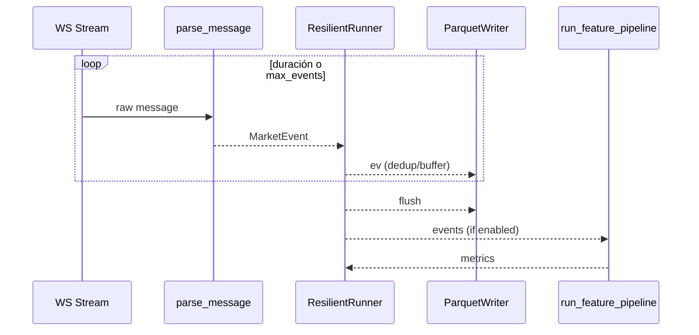
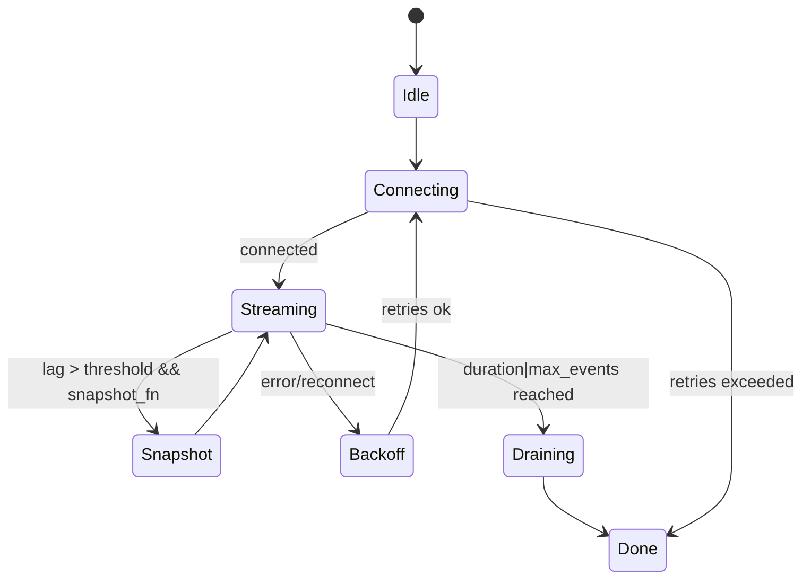
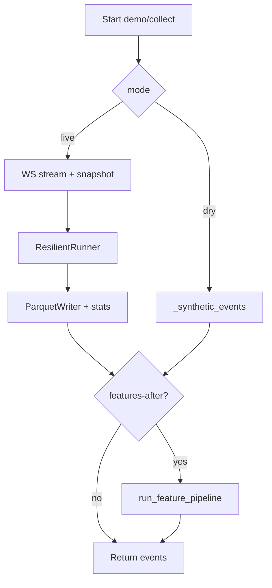

# Módulo de Ingestión — Arquitectura Técnica

## Visión general
Ingesta eventos de mercado (WS/REST) y los normaliza a `MarketEvent`, con resiliencia, deduplicación opcional y escritura a Parquet. Se prioriza simplicidad (stdlib) y testabilidad, dejando el throughput extremo para una ruta “fast-path” configurable.

## Módulos principales y responsabilidades
- `ingestion.client`  
  - Construye URLs de stream (`build_streams`, `build_ws_url`).  
  - Parsea mensajes (`parse_message`) y normaliza payloads (`normalize_trade`, `normalize_kline`).  
  - Registro extensible de normalizers (tipos de evento) y, si se amplía, de stream builders.
- `ingestion.resilience`  
  - `ResilientRunner`: loop de consumo con backoff, snapshot opcional, dedup y métricas (lag, latencia, buffer).  
  - Métricas operativas: `reconnects`, `buffer_skipped`, `max_latency_seconds`, `last_lag_seconds`, `dedup_resets` (si se añade).
- `ingestion.pipeline`  
  - `collect_events`: orquesta ingestión dry/live, aplica dedup y buffer, escribe Parquet (live), puede disparar `run_feature_pipeline` tras ingest.  
  - Hook configurable para batch size, dedup on/off, buffer size.
- `ingestion.storage`  
  - `ParquetWriter`: escribe eventos en particiones locales.
- `ingestion.demo`  
  - Demo en vivo de punta a punta (stream → Parquet → features) con métricas resumidas.

## Relaciones entre módulos
- `pipeline.collect_events` usa `client.build_ws_url` + `_ws_stream` y alimenta a `ResilientRunner`.
- `ResilientRunner` invoca `parse_message`/normalizers y pasa eventos al handler (writer + métricas).
- `demo` reutiliza `collect_events` y luego `features.pipeline.run_feature_pipeline`.

## Flujo de datos (live)
WS → `_ws_stream` → `parse_message` → `MarketEvent` → `ResilientRunner` (dedup, lag/latency) → handler (`ParquetWriter.add` + stats) → opcional `run_feature_pipeline` → Parquet/logs.

## Decisiones arquitectónicas y razones
- **Stdlib + libs mínimas (websockets/httpx)**: facilitar testeo, evitar dependencia de frameworks pesados.  
- **Runner síncrono**: menos complejidad y fácil de cubrir con tests unitarios; trade-off en throughput.  
- **Dedup en memoria**: evita duplicados de stream rápidamente; trade-off de memoria en sesiones largas (mitigable con reset opcional).  
- **Snapshot REST opcional**: recupera gaps a costa de latencia en la reconexión; activable solo cuando se detecta lag.  
- **Hooks configurables (buffer, dedup, batch, features-after-ingest)**: exponen controles sin cambiar código, para ajustar entre confiabilidad y throughput.

## Trade-offs
- Throughput vs. simplicidad: modelo síncrono limita 100k+/s; se prioriza claridad y resiliencia básica.  
- Dedup vs. memoria: `seen` crece; se permite desactivarlo o limitarlo.  
- Snapshot vs. latencia: resync puede pausar consumo; preferible en datos críticos, desactivable en fast-path.

## Riesgos
- Alto volumen: buffer/GC pueden ser cuellos si no se ajusta batch/buffer.  
- Fuentes nuevas: aunque hay registro de normalizers, `build_streams` aún asume trade/kline.  
- Data loss: solo se cuenta `buffer_skipped`; no hay métricas de parse errors.  
- IO: escritura Parquet por evento si no se usa batching.

## Qué hace / qué no debe hacer
- Hace: normaliza trades/klines, maneja reconexión con backoff, deduplica en vivo, escribe Parquet local, expone métricas básicas, puede disparar features tras ingest.  
- No debe: asumir throughput ultra-alto sin tuning; mezclar lógica de estrategia/ejecución; depender de buses externos; almacenar `seen` indefinidamente sin límites en sesiones muy largas.

## Posibles mejoras
- Batching efectivo de IO (en curso) y flush seguro en excepciones.  
- Dedup limitada/rotativa y dedup en backfill.  
- Métricas adicionales: throughput (events/s), parse errors, dedup_resets.  
- Registro de stream builders dinámicos para nuevas fuentes.  
- Fast-path experimental (dedup off, snapshot off, batch grande, logging mínimo).

---

## Diagramas (Mermaid)

### Componentes
```mermaid
flowchart LR
  WS[WS/REST Source] --> C1[ingestion.client\n(parse_message, normalizers)]
  C1 --> R1[ResilientRunner\nbackoff/dedup/metrics]
  R1 --> H[Handler\nParquetWriter + stats]
  H --> F[run_feature_pipeline (opcional)]
  F --> LOG[Logs métricas]
```

### Secuencia (live, con features-after-ingest)


### Estados del sistema (ingest live)


### Flujo (simplificado)


### API (funciones clave)
```mermaid
flowchart LR
  subgraph ingestion.pipeline
    CE[collect_events(mode, cfg,\nmax_events, duration_s,\nlogger, compute_features_after,\nmax_buffer, dedup_enabled)] --> Events
  end
  subgraph ingestion.resilience
    RR[ResilientRunner.run(handler,\nmax_retries, stop_on_complete)] --> Metrics
  end
  subgraph features.pipeline
    FP[run_feature_pipeline(events, window)] --> FeatureVectors
  end
  Events --> FP
```
